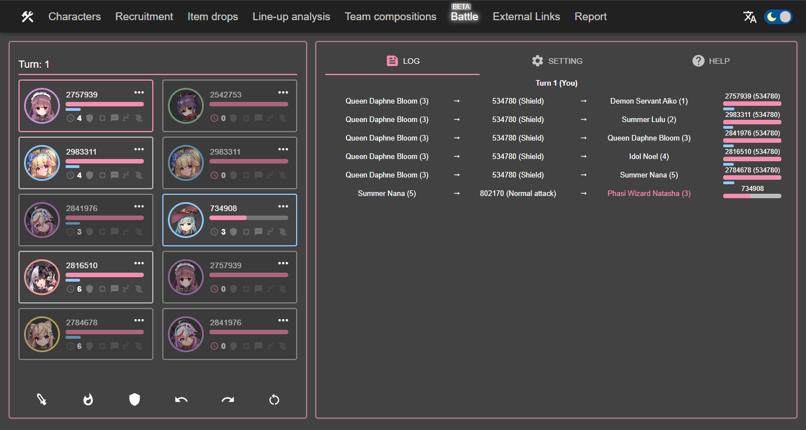

# TenkafuMA! toolbox

中文說明請至 [此](README.zh-TW.md)

[Demo](https://purindaisuki.github.io/tkfmtools/en/)

The goal of this project is to collect, organize and present the data in TenkafuMA!.

## Feature
**Line-up analysis**

Provide visual representations to help you understand your line-up.

**Team compositions recorder**

Record and share your team compositions for stages.

**Battle simulator**

Simulate the process of battle in the game.

**Recruitment filter**

Find promising tag combinations giving high rarity characters.

**Item drops filter**

Screen out stages by target items.

**Character potential calculator**

Compute potential buffs and materials requirement for characters.

**Characters and items**

Show character recruitment tags and items drops.

## Libraries backing TenkafuMA! toolbox
* [React](https://reactjs.org/)
* [Gatsby](https://www.gatsbyjs.com/)
* [Material-UI](https://material-ui.com/)
* [styled-components](https://styled-components.com/)
* [Firebase](https://firebase.google.com/)
* [nivo](https://nivo.rocks/)
* [react-beautiful-dnd](https://github.com/atlassian/react-beautiful-dnd)
* [react-masonry-css](https://github.com/paulcollett/react-masonry-css)
* [react-helmet](https://github.com/nfl/react-helmet)
* [nanoid](https://github.com/ai/nanoid)
* [html2canvas](https://github.com/niklasvh/html2canvas)
* [boardgame.io](https://github.com/boardgameio/boardgame.io)

## Feedback
Bug reports, suggestion and thoughts are always welcome. Please contact me via:
* [Github issues](https://github.com/purindaisuki/tkfmtools/issues)
* [Questionbox](https://peing.net/en/b5295760aebf4c)
* or tag me *purin#4265* on [TenkafuMA! official discord group](https://discord.gg/wJqXQjVnw4).

## License
* [The MIT License](https://github.com/purindaisuki/tkfmtools/blob/master/LICENSE)
* NOTE: SVG ICONS FROM [Material icons - Google Design](https://github.com/google/material-design-icons) ARE LICENSED UNDER [Apache License 2.0](https://github.com/google/material-design-icons/blob/master/LICENSE). THE ART RESOURCES FORM Tenkafu MA! ARE ALSO NOT LICENSED BY MIT AND RESERVED FOR SG Art Inc.
