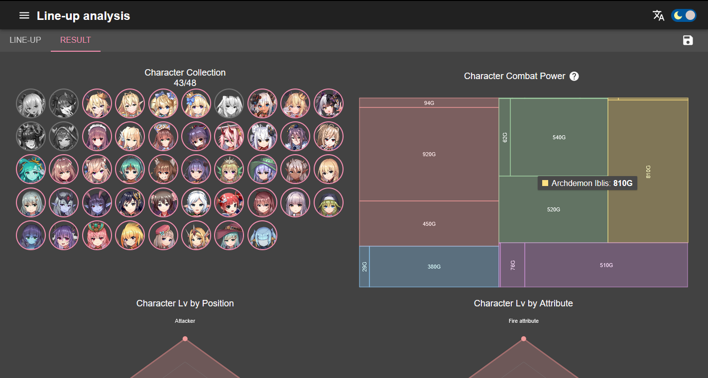
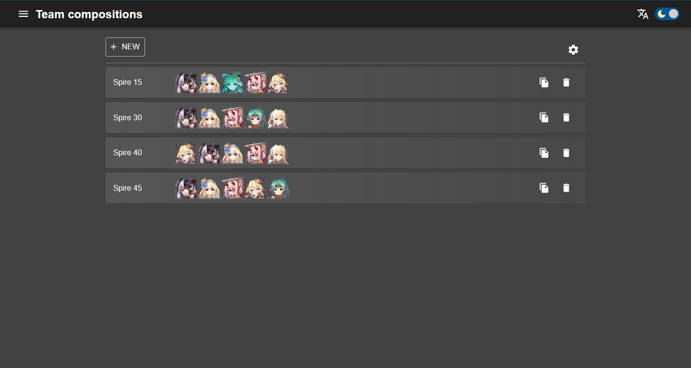
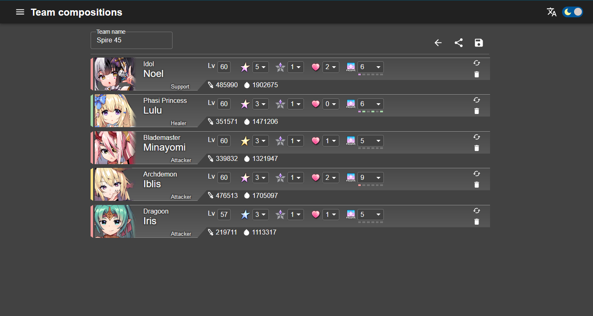
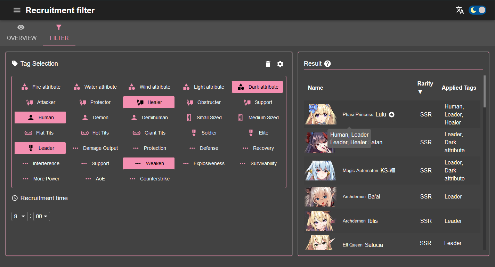
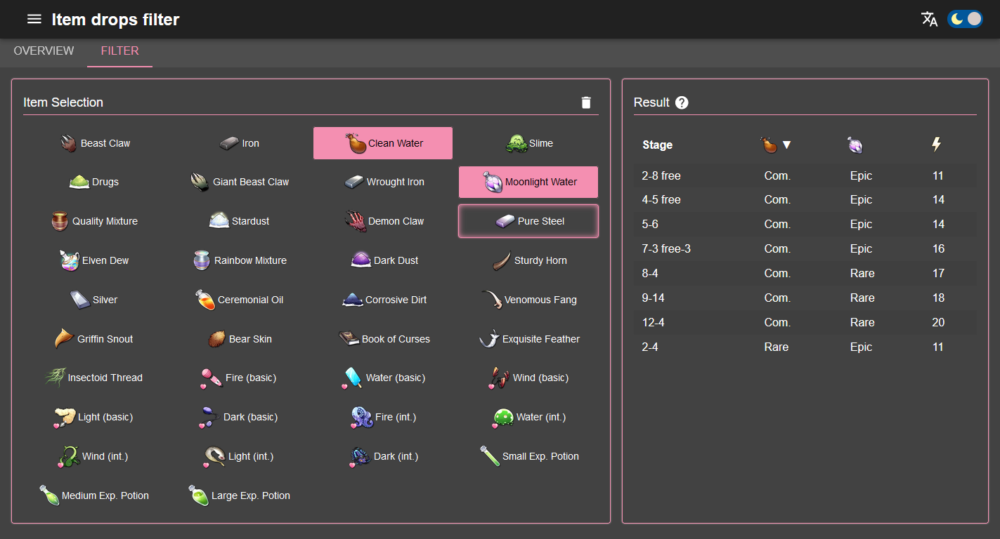
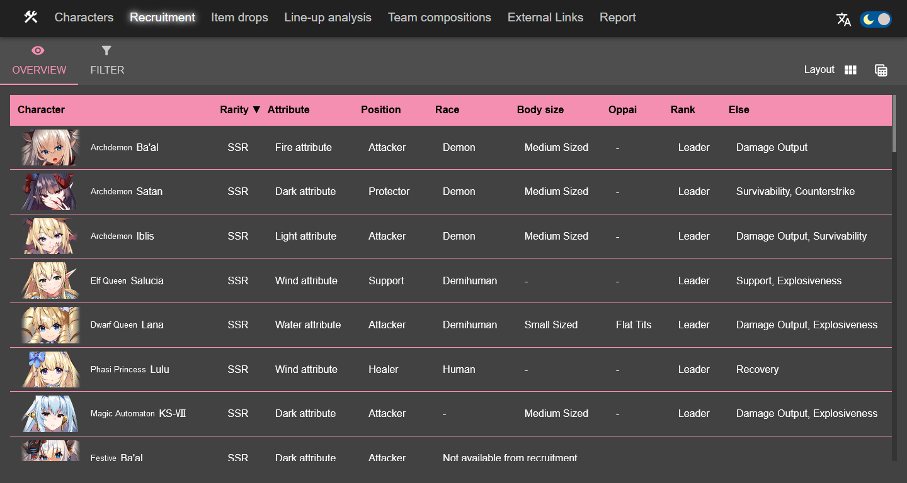
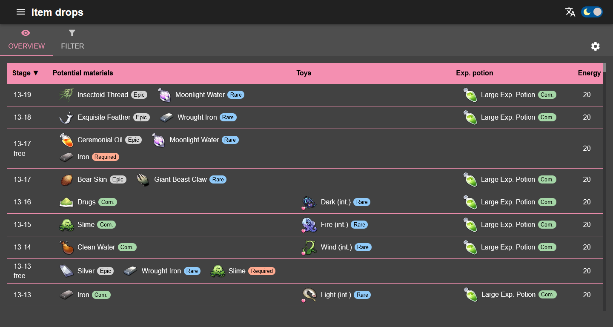

# 天下布魔工具箱

[Demo](https://purindaisuki.github.io/tkfmtools/)

本站為基於手遊天下布魔中數據所建之網站，旨在統整資料、並提供方便的工具。

## 功能
**隊伍分析**

視覺化資料以供檢視隊伍。

**隊伍組成**

管理、分享關卡隊伍組成。

**全境徵才篩選器**

利用標籤篩選角色，並找出有利的組合。

**道具掉落篩選器**

根據目標道具查找相應之關卡。

**角色潛力計算**

計算角色所需潛力道具及增益。

**角色與道具**

提供角色標籤及道具掉落一覽。

## 第三方框架 / 函式庫
* [React](https://reactjs.org/)
* [Gatsby](https://www.gatsbyjs.com/)
* [Material-UI](https://material-ui.com/)
* [styled-components](https://styled-components.com/)
* [Firebase](https://firebase.google.com/)
* [nivo](https://nivo.rocks/)
* [react-beautiful-dnd](https://github.com/atlassian/react-beautiful-dnd)
* [react-masonry-css](https://github.com/paulcollett/react-masonry-css)
* [react-helmet](https://github.com/nfl/react-helmet)
* [nanoid](https://github.com/ai/nanoid)
* [html2canvas](https://github.com/niklasvh/html2canvas)

## 意見回饋
歡迎以下列連結回報 Bug、建議、使用心得等。
* [Github issues](https://github.com/purindaisuki/tkfmtools/issues)
* [Questionbox](https://peing.net/ja/b5295760aebf4c)
* 或在 [官方 discord 群](https://discord.gg/RRRABMtHYj)、[場外 discord 群](https://discord.gg/GR9fh9MfVw) @ [我](justwepurin#4265)

## License
* [The MIT License](https://github.com/purindaisuki/tkfmtools/blob/master/LICENSE)
* NOTE: SVG ICONS FROM [Material icons - Google Design](https://github.com/google/material-design-icons) ARE LICENSED UNDER [Apache License 2.0](https://github.com/google/material-design-icons/blob/master/LICENSE). THE ART RESOURCES FORM Tenkafu MA! ARE ALSO NOT LICENSED BY MIT AND RESERVED FOR SG Art Inc.
